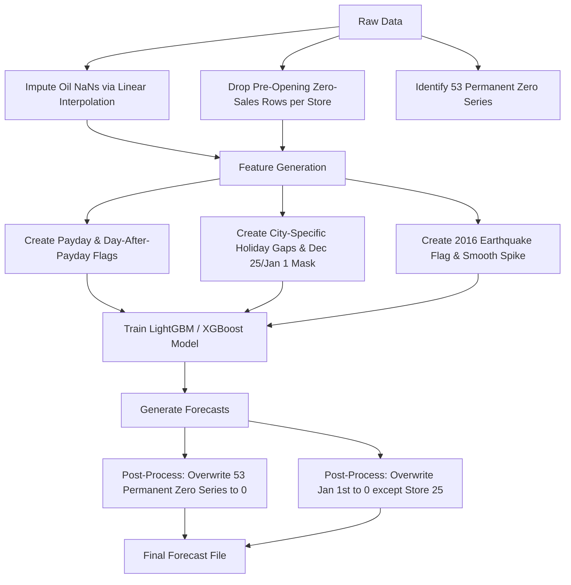

# Exploratory Data Analysis (EDA) Report
## Ecuadorian Supermarket Sales Time Series Forecasting

This report provides a deep-dive analysis of the dataset, identifying critical anomalies, seasonal behaviors, external shocks, and structural factors that must be accounted for in forecasting models.

---

## 📋 Executive Summary
* **Goal**: Forecast daily sales across **54 stores** and **33 product families** (1,782 time series in total).
* **Train Date Range**: `2013-01-01` to `2017-08-15` (1,684 active days after accounting for Christmas closures).
* **Test Date Range**: `2017-08-16` to `2017-08-31` (16 days).
* **Key Discovery**: Standard time series features (like bare lags, rolling averages, and linear oil price trends) will suffer from severe bias unless specific retail behaviors, localized holiday effects, and macroeconomic patterns are engineered explicitly.

---

## 🔍 Hidden Findings & Critical Factors

### 1. 📅 Calendar Gaps & New Year Closures
> [!IMPORTANT]
> **Supermarkets close completely on Christmas Day and almost completely on New Year's Day.**

* **Christmas Day (Dec 25)**: The dates `2013-12-25`, `2014-12-25`, `2015-12-25`, and `2016-12-25` are completely missing from the training set. Shops are closed, and no data was recorded.
* **New Year's Day (Jan 1)**: These dates are present in the training set, but sales are near-zero. Specifically, **only Store 25** (and Store 36 in 2014) is open and active on Jan 1st.
  * **2013-01-01**: Only Store 25 active (Sales: 2,511.62)
  * **2014-01-01**: Store 25 (Sales: 4,992.53) & Store 36 (Sales: 3,609.53) active
  * **2015-01-01**: Only Store 25 active (Sales: 12,773.62)
  * **2016-01-01**: Only Store 25 active (Sales: 16,433.39)
  * **2017-01-01**: Only Store 25 active (Sales: 12,082.50)
* **Modeling Action**: Hardcode all store predictions to `0` for Christmas Day (if forecasting over Christmas) and New Year's Day (except for Store 25).

---

### 2. 🏪 Store Lifespans & Late Openings
Although every store has rows starting from `2013-01-01` in `train.csv` (55,572 rows per store), **several stores did not actually open until much later in the timeline.**

| Store Number | First Transaction Date | Days of Zero Sales (Pre-Opening) |
|:---:|:---:|:---:|
| **Store 52** | `2017-04-20` | **1,570 days** (Opened only 4 months before train set end) |
| **Store 22** | `2015-10-09` | **1,011 days** |
| **Store 42** | `2015-08-21` | **962 days** |
| **Store 21** | `2015-07-24` | **934 days** |
| **Store 29** | `2015-03-20` | **808 days** |
| **Store 20** | `2015-02-13` | **773 days** |
| **Store 53** | `2014-05-29` | **513 days** |
| **Store 36** | `2013-05-09` | **128 days** |

> [!WARNING]
> Training models on these stores using the entire history will severely distort historical averages, lag features, and rolling statistics.
> **Modeling Action**: Exclude the pre-opening zero-sales periods from the training data for each respective store, or add a binary `store_is_open` flag.

---

### 3. 🚨 The 2016 Ecuador Earthquake Anomaly
On **April 16, 2016**, a devastating magnitude 7.8 earthquake struck Ecuador (centered in the Manabi province). The government declared state-of-emergency events that are documented in the holidays dataset for 30 consecutive days (`Terremoto Manabi` to `Terremoto Manabi+30`).

* **Sales Spike**: Average daily sales nationwide jumped by **20.23%** in the two weeks post-earthquake ($959,768 vs $798,300).
* **Category Shifts**: The sales lift was heavily concentrated in emergency food, water, hygiene, and cleanup supplies.

| Product Family | Pre-Earthquake Avg Sales | Post-Earthquake Avg Sales | Absolute Change | Percentage Change |
|:---|:---:|:---:|:---:|:---:|
| **PERSONAL CARE** | 324.39 | 459.60 | +135.21 | **+41.68%** |
| **GROCERY I** | 4,406.00 | 6,149.78 | +1,743.79 | **+39.58%** |
| **HOME CARE** | 294.08 | 386.96 | +92.88 | **+31.58%** |
| **BEVERAGES** | 3,153.81 | 3,994.77 | +840.96 | **+26.66%** |
| **CLEANING** | 1,176.30 | 1,315.96 | +139.66 | **+11.87%** |

> [!CAUTION]
> If not isolated, this one-off historical spike will bias seasonality curves, leading models to predict a spurious annual sales surge in mid-April.
> **Modeling Action**: Use an earthquake event flag, or smooth/interpolate the sales during this period to prevent overfitting to a natural disaster.

---

### 4. 💸 The Bi-Weekly Wage Payment Cycle
Salaries in Ecuador are paid bi-weekly: on the **15th** and the **last day of the month** (the 30th or 31st).

* **The "Day After" Effect**: While the payday itself sees a minor lift (+1.4%), the **day immediately following payday (the 16th and the 1st of the next month) is the real shopping peak**, experiencing a massive **+8.0% national sales increase** (average sales of $685,010 vs $634,240 on other days).
* **Weekday vs Weekend Interaction**:
  * If payday falls on a weekday (Monday, Tuesday, or Wednesday), it boosts sales by **+4.7% to +7.5%**.
  * If payday falls on a weekend (Friday, Saturday, or Sunday), its impact is negligible or slightly negative (as weekend sales are already at maximum capacity).
* **Modeling Action**: Create binary flags for `is_payday`, `is_day_after_payday`, and `days_since_last_payday`.

---

### 5. 🛢️ Spurious Oil Price Correlation
Ecuador's economy is oil-dependent, and the raw correlation between daily oil prices and daily sales is heavily negative: **-0.6280** (and **-0.7511** at the monthly level).

> [!TIP]
> **This negative correlation is a spurious trend-based artifact.**
> Between 2013 and 2017, supermarket sales grew steadily due to expansion and inflation, while global oil prices collapsed (dropping from ~$100 in 2013 to ~$45 in 2015-2017).
> Inside individual years, the correlation drops to near zero:
> * **2013**: +0.0392 | **2015**: -0.3343 | **2016**: +0.1103 | **2017**: **+0.0011**

* **Modeling Action**: Avoid using raw oil price in linear models without detrending or differencing. If using tree-based models, ensure the model does not over-rely on oil price to represent the global time trend.

---

### 6. 🚫 Hardcoded Zero-Sales Store-Family Pairs
Out of the 1,782 possible combinations of stores and product families, **exactly 53 combinations have zero sales throughout the entire training period.**

* **Total Zero Series**: 53 combinations.
* **By Family**:
  * **BOOKS**: 28 stores never sold a book (e.g., Stores 9, 10, 11, 12, 13, 14, 15, 16, 17, 18, 19).
  * **BABY CARE**: 12 stores never sold baby care products (e.g., Stores 1, 13).
  * **LADIESWEAR**: 10 stores (e.g., Store 16).
  * **LAWN AND GARDEN**: 3 stores (e.g., Store 14).
* **Modeling Action**: Hardcode the test forecasts for these 53 specific combinations to exactly `0`. This eliminates false-positive sales noise and directly optimizes metrics like RMSLE.

---

### 7. 🎁 Test Set Promotion Heavy-bias
* **Promotion Percentage**:
  * **Train Set**: Only **20.37%** of rows have an active promotion (`onpromotion > 0`).
  * **Test Set**: A massive **44.08%** of rows have active promotions.
* **Sensitivity**: Row-level correlation between promotions and sales is **0.4279**.
* **School Supplies Extreme Sensitivity**: The **SCHOOL AND OFFICE SUPPLIES** family has a promotion-to-sales correlation of **0.6698**. Since the test set takes place in late August (onset of the Sierra school season in Ecuador), promotions in school supplies will drive massive non-linear sales spikes.
* **Modeling Action**: The forecasting model must treat promotions as a primary driver, particularly for highly elastic categories like School Supplies, Beverages (0.3727), and Home Care (0.3696).

---

### 8. 🎭 The Local Holiday Paradox
* When comparing local holidays to own-city baselines (excluding Quito and Guayaquil bias), **sales in the holiday-celebrating city actually drop by an average of -6.91% (median: -7.42%)** on local holiday dates.
* **Why?** People likely travel out of town or local stores reduce operating hours, shifting retail traffic away from the supermarkets.
* **Modeling Action**: A local holiday flag should be city-specific and should be expected to exert a *downward* pressure on local store sales, rather than a generic upward boost.

---

## 🛠️ Feature Engineering & Modeling Strategy

Based on the hidden findings, the following schema is recommended for the pipeline:

### Key Recommendations for Modeling
1. **Oil Price Imputation**: Fill the 43 weekday NaNs in `oil.csv` using linear interpolation, then forward fill/backward fill to add weekend oil prices so the series matches the daily calendar.
2. **Lag Features**: Create lags on `onpromotion` (especially forward lags/leads if promotion calendars are known).
3. **Transaction Imputation**: There are **118 store-date records** where sales are positive but transactions are missing. If using transactions as a feature, impute these values (e.g., using median daily transactions for that weekday/store).
4. **Validation Split**: A rolling window validation split is highly recommended. Given that the test set is 16 days (`Aug 16` to `Aug 31`), use the last 16 days of the training set (`Jul 30` to `Aug 15`) as the local validation set to mirror the test horizon.
