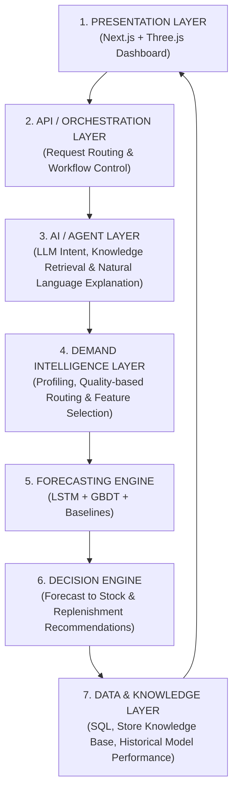
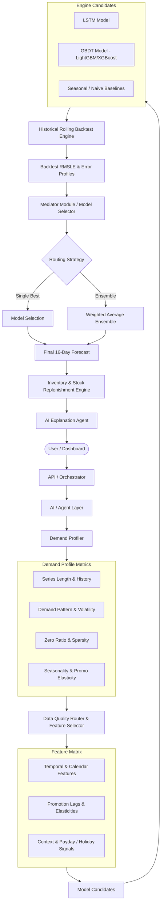

# System Architecture & Adaptive Forecasting Engine Design

## 1. Executive Summary
This document specifies the multi-layer, adaptive forecasting architecture designed to integrate machine learning engines (LSTM, GBDT, Baselines), automated demand profiling, historical backtest mediation, and an interactive AI explanation layer for retail inventory decisions.

---

## 2. Conceptual System Architecture (7 Layers)

---

## 3. End-to-End Execution & Mediation Flow

---

## 4. Pipeline State & Function Definitions

### State 1 — Data Ingestion & Preprocessing
* **Inputs**: `train.csv`, `stores.csv`, `oil.csv`, `holidays_events.csv`, `transactions.csv`, `test.csv`.
* **Output**: Unified clean dataframe, properly indexed by datetime and entity IDs (`store_nbr` × `family`).

### State 2 — Series Construction
* **Target**: Build 1,782 individual time series ($54 \text{ stores} \times 33 \text{ families}$).
* **Properties**: Assign unique series key `store_nbr_family` and track lifetime metadata.

### State 3 — Demand Profiling
For every individual series, compute structural metrics:
* `series_length` & active span.
* `zero_ratio` (percentage of zero sales).
* `coefficient_of_variation` (CV = $\sigma / \mu$).
* `autocorrelation` & seasonality strength.
* `promotion_elasticity` & `holiday_sensitivity`.

### State 4 — Data-Quality Routing
Direct series into specific processing tracks based on profile:
* **Inactive Series (e.g., 53 permanent zero pairs)** $\rightarrow$ Hardcoded zero forecast.
* **Extremely Sparse / Intermittent Series** $\rightarrow$ Croston / Sparse-demand model.
* **Short History Series** $\rightarrow$ Transfer learning / GBDT global pooling.
* **Standard Series** $\rightarrow$ Full LSTM + GBDT + Baseline execution track.

### State 5 — Feature Selection Engine
Dynamically configure candidate feature sets (Calendar, Lags, Rolling Stats, Payday Flags, Promotion Leads) according to category elasticity.

### State 6 — LSTM Deep Learning Engine
* Sequence-to-sequence or sliding window architecture ($60 \text{ past days input} \rightarrow 16 \text{ future days output}$).
* Captures non-linear temporal interactions and complex cross-series embeddings.

### State 7 — GBDT Gradient Boosting Engine (LightGBM/XGBoost)
* Consumes tabular lag features, rolling statistics, calendar indicators, and categorical embeddings.
* Superior handling of abrupt promotional spikes and localized event flags.

### State 8 — Baseline Engine
* Generates benchmark forecasts (e.g., Same-weekday moving average, Last 16 days naive persistence).
* Establishes the minimum acceptable performance baseline.

### State 9 — Historical Rolling Backtest Engine
* Simulates real-world forecasting by stepping back historically over multiple 16-day evaluation windows.
* Calculates exact RMSLE for LSTM, GBDT, and Baseline on a per-series basis.

### State 10 — Multi-Model Mediator
Receives demand profiles, backtest errors, and data quality metrics to dynamically route each series:
* **Single Best Selection**: Picks the lowest RMSLE model for that specific demand pattern.
* **Adaptive Weighting**: Combines predictions using inverse-variance or soft-max error weights:
  $$w_m = \frac{\exp(-\lambda \cdot \text{RMSLE}_m)}{\sum_{k} \exp(-\lambda \cdot \text{RMSLE}_k)}$$

---

## 5. Academic Motivation & Core Innovation
Rather than relying on a static, single-model approach (e.g., applying LSTM universally), this architecture implements an **Adaptive Product-Level Multi-Model Engine**.

### Core Academic Rationales:
1. **Model Diversity**: Deep learning models (LSTM) excel on smooth, high-volume temporal series, whereas tree-based models (GBDT) outperform on promotional spikes and tabular event flags.
2. **Category Heterogeneity**: Certain product families (e.g., Beverages or Staples) demonstrate fundamentally different demand dynamics compared to impulse items or seasonal goods.
3. **Robustness Against Over-Engineering**: For sparse or low-volume series, complex deep learning models overfit, making simple baselines or hardcoded rules superior.
