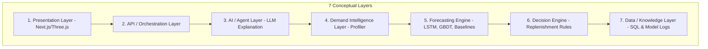
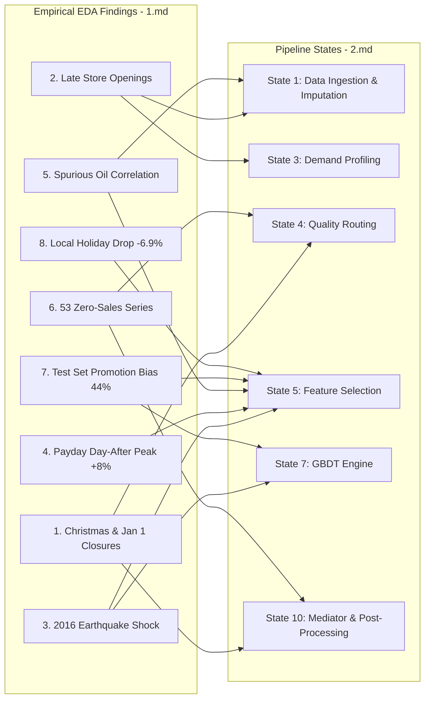

# Unified Architecture & EDA Synthesis Report
## Adaptive Multi-Model Retail Sales Forecasting Engine

This report synthesizes the **System Architecture** ([2.md](file:///c:/Users/bolis/OneDrive/Desktop/v1.101/data_analysis/2.md)) with the empirical findings from our **Exploratory Data Analysis** ([1.md](file:///c:/Users/bolis/OneDrive/Desktop/v1.101/data_analysis/1.md)). It establishes how specific data anomalies, temporal dynamics, and macroeconomic shock patterns directly control and optimize each layer of the forecasting engine.

---

## 1. 🏗️ Architectural Overview ([2.md](file:///c:/Users/bolis/OneDrive/Desktop/v1.101/data_analysis/2.md))

The proposed system is an **Adaptive Product-Level Multi-Model Demand Forecasting Engine** structured into **7 Conceptual Layers** and executed across **10 Pipeline States**:

### Core Innovation: Adaptive Mediation
Instead of forcing a single model (such as a global LSTM) across all $1,782$ series ($54 \text{ stores} \times 33 \text{ families}$), the **Mediator Module (State 10)** uses historical rolling backtesting (**State 9**) and automated demand profiling (**State 3**) to dynamically pick or ensemble the best engine (`LSTM`, `GBDT`, or `Baseline`) for each distinct product-store pair.

---

## 2. 🔗 Empirical Data Findings ([1.md](file:///c:/Users/bolis/OneDrive/Desktop/v1.101/data_analysis/1.md)) $\rightarrow$ Pipeline State Mapping

Below is the direct mapping showing how each empirical finding from [1.md](file:///c:/Users/bolis/OneDrive/Desktop/v1.101/data_analysis/1.md) is operationalized within the pipeline states of [2.md](file:///c:/Users/bolis/OneDrive/Desktop/v1.101/data_analysis/2.md):

---

## 3. 🎯 Detailed Mapping & Technical Implementation

### Finding A: 53 Hardcoded Zero-Sales Series & Pre-Opening Lifespans
* **Data Context ([1.md](file:///c:/Users/bolis/OneDrive/Desktop/v1.101/data_analysis/1.md))**:
  * $53$ store-family combinations have **exactly zero sales** across all 4+ years ($28$ stores for `BOOKS`, $12$ for `BABY CARE`).
  * $8$ stores opened late (e.g., Store 52 opened 1,570 days after `2013-01-01`).
* **Architectural Action ([2.md](file:///c:/Users/bolis/OneDrive/Desktop/v1.101/data_analysis/2.md))**:
  * **State 1 (Ingestion)**: Truncate training history prior to `first_transaction_date` for each store to remove zero-sales distortion from rolling features.
  * **State 4 (Quality Routing)**: Identify inactive series during demand profiling and bypass ML engines entirely.
  * **State 10 (Mediator)**: Hardcode predictions for these 53 series to `0.0`.

### Finding B: Payday "Day After" Peak (+8.0% Sales Lift)
* **Data Context ([1.md](file:///c:/Users/bolis/OneDrive/Desktop/v1.101/data_analysis/1.md))**:
  * Salaries are paid on the 15th and end-of-month. The **day immediately following payday (16th and 1st of next month)** experiences an **+8.0% national sales surge**.
  * Weekday paydays boost sales significantly (+7.5% on Wednesdays), while weekend paydays have zero marginal lift.
* **Architectural Action ([2.md](file:///c:/Users/bolis/OneDrive/Desktop/v1.101/data_analysis/2.md))**:
  * **State 5 (Feature Selection)**: Engineer explicit interaction terms:
    * `is_payday` $\times$ `day_of_week`
    * `is_day_after_payday` (16th & 1st of month)
    * `days_since_last_payday`

### Finding C: 2016 Ecuador Earthquake (+20.23% Sales Spike)
* **Data Context ([1.md](file:///c:/Users/bolis/OneDrive/Desktop/v1.101/data_analysis/1.md))**:
  * A magnitude 7.8 earthquake on April 16, 2016 triggered a 30-day emergency state. Daily sales surged **+20.23%**, concentrated in `PERSONAL CARE` (+41.68%), `GROCERY I` (+39.58%), and `BEVERAGES` (+26.66%).
* **Architectural Action ([2.md](file:///c:/Users/bolis/OneDrive/Desktop/v1.101/data_analysis/2.md))**:
  * **State 5 & 7 (Features & GBDT)**: Add binary indicator `is_earthquake_period` (`2016-04-16` to `2016-05-16`). Apply target smoothing during model training so GBDT/LSTM engines do not overfit an annual seasonal peak to April 16th.

### Finding D: Test Set Promotion Heavy-bias (44.08% vs 20.37%)
* **Data Context ([1.md](file:///c:/Users/bolis/OneDrive/Desktop/v1.101/data_analysis/1.md))**:
  * The test set has more than double the promotion density of the training set (44.08% vs 20.37%).
  * `SCHOOL AND OFFICE SUPPLIES` has a promo-to-sales correlation of **0.6698**.
* **Architectural Action ([2.md](file:///c:/Users/bolis/OneDrive/Desktop/v1.101/data_analysis/2.md))**:
  * **State 3 (Profiling)**: Tag series with high `promotion_elasticity`.
  * **State 7 (GBDT Engine)**: GBDT handles non-linear promo multipliers far better than standard linear baselines. For high-elasticity series (`SCHOOL SUPPLIES`, `BEVERAGES`), favor GBDT in State 10 mediation.

### Finding E: Spurious Oil Price Correlation (-0.6280)
* **Data Context ([1.md](file:///c:/Users/bolis/OneDrive/Desktop/v1.101/data_analysis/1.md))**:
  * The strong negative correlation between oil prices and sales (-0.6280 daily, -0.7511 monthly) is spurious due to opposite macro trends (sales growing while oil prices collapsed from 2013 to 2017). Yearly correlations are near zero (0.0011 in 2017).
* **Architectural Action ([2.md](file:///c:/Users/bolis/OneDrive/Desktop/v1.101/data_analysis/2.md))**:
  * **State 1 & 5 (Ingestion & Features)**: Impute the 43 weekday NaNs in `oil.csv` using linear interpolation. Supply **first-differenced oil price** ($\Delta \text{oil}_t$) and **detrended oil price** rather than raw values to avoid trend-driven tree splits.

### Finding F: Local Holiday Paradox (-6.91% Drop)
* **Data Context ([1.md](file:///c:/Users/bolis/OneDrive/Desktop/v1.101/data_analysis/1.md))**:
  * On local holidays, sales in the celebrating city drop by an average of **-6.91%** relative to its own weekday baseline.
* **Architectural Action ([2.md](file:///c:/Users/bolis/OneDrive/Desktop/v1.101/data_analysis/2.md))**:
  * **State 5 (Features)**: Ensure local holiday indicators are scoped **strictly to stores located in that specific city** (`city == locale_name`), encoding a downward adjustment factor.

---

## 4. 🤖 AI Agent & Explanation Integration (Layer 3)

As specified in Layer 3 of [2.md](file:///c:/Users/bolis/OneDrive/Desktop/v1.101/data_analysis/2.md), the **AI Agent / LLM Layer** sits above the numerical forecasting pipeline to provide interactive explanations to store managers.

### Grounded Retrieval Rules:
1. **No Numerical Hallucination**: The LLM queries the Data & Knowledge Layer (Layer 7) for actual forecast values and model backtest errors.
2. **Context-Aware Explanation Examples**:
   * *User*: "Why is the forecast for School Supplies spiking in late August at Store 14?"
   * *AI Agent Response*: "The forecast indicates a +145% surge driven by two factors: (1) high promotional intensity in the test set (44% promo density vs 20% historical), and (2) the onset of the Sierra region school season. Historically, School Supplies show a 0.67 correlation with promotion status."
   * *User*: "Why is Store 52's history zero prior to April 2017?"
   * *AI Agent Response*: "Store 52 was unopened prior to April 20, 2017. The pipeline automatically routed Store 52 to a short-history training track to avoid zero-sales bias."

---

## 5. 🚀 Summary Matrix: How Mediator Strategy Adapts

| Demand Profile / Category Pattern ([1.md](file:///c:/Users/bolis/OneDrive/Desktop/v1.101/data_analysis/1.md)) | Primary Model Engine ([2.md](file:///c:/Users/bolis/OneDrive/Desktop/v1.101/data_analysis/2.md)) | Rationale & Pipeline Action |
|:---|:---:|:---|
| **53 Permanent Zero Series** (e.g. Books in Store 9) | **Hardcoded Zero** | Bypass ML engines entirely; set forecast to `0.0`. |
| **High Promo Elasticity** (School Supplies, Beverages) | **GBDT (LightGBM/XGBoost)** | GBDT captures abrupt promotional spikes and non-linear interactions. |
| **High Volume & Smooth Seasonality** (Grocery I, Produce) | **LSTM / Ensemble** | LSTM captures complex sequence patterns and cross-day dependencies. |
| **Short History Stores** (Store 52, Store 22) | **GBDT Global Pooling** | Global pooling across all stores prevents overfitting on sparse single-store history. |
| **Calendar Closed Dates** (Dec 25, Jan 1 non-Store 25) | **Hardcoded Zero Mask** | Overwrite predictions to `0.0` during post-processing. |
